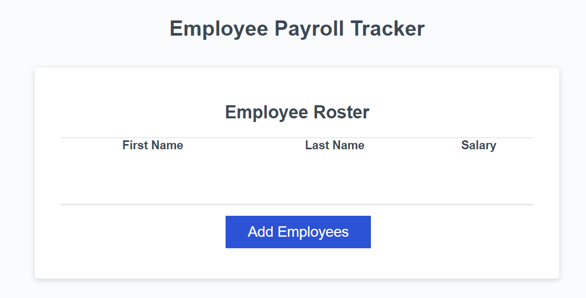

# Employee Payroll Tracker

This Employee Payroll Tracker is a simple web application that allows users to track employee data, including their first name, last name, and salary. It provides functionalities to add employees, calculate and display the average salary of all employees, select a random employee, and display the employee roster in an HTML table.

## Features

- **Add Employees:** Users can add employee data such as first name, last name, and salary.
- **Calculate Average Salary:** The application calculates and displays the average salary of all employees.
- **Select Random Employee:** Users can select a random employee from the roster.

## Technologies Used
- HTML
- JavaScript

## Usage

To use the Employee Payroll Tracker, simply open the `index.html` file in a web browser. You will see a table displaying the employee roster, along with an "Add Employees" button. Clicking the "Add Employees" button prompts the user to enter the details of each employee, including their first name, last name, and salary. Once all employee data is entered, the average salary across all employees is calculated and displayed, and a random employee is selected as the winner of a drawing. The employee roster is then sorted alphabetically by last name and displayed in the HTML table.

## Installation

No installation is required. Simply clone or download the repository and open the `index.html` file in your web browser.

## Contributing

Contributions are welcome! If you'd like to contribute to the project, please fork the repository and submit a pull request with your changes.

## License

This project is licensed under the [MIT License](LICENSE).